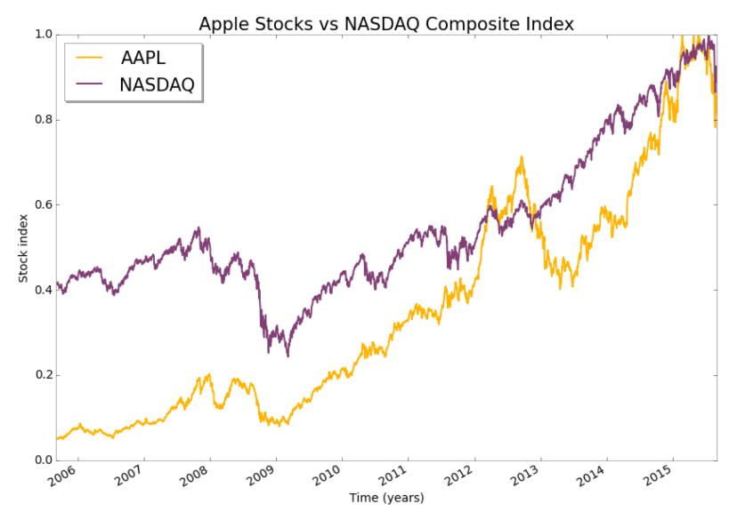
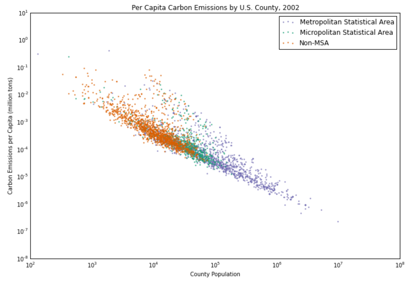

PLOT 1: yx1088  yanchao1992

CLARITY: The plot is easy to read, although I would highlight the following confusing points: 
(1)	The plot is titled “The Age of Male Citibike Riders and Their Ridership”. “Ridership” is a vague term in this context, so the title does not clearly communicate the content of the plot; 
(2)	The time period being represented is unclear in the plot;
(3)	The y-axis does not specify the unit of the trip duration.

ESTHETICS: The sizes of the plot title and axis labels are clearly disproportionate to the plot itself.  

HONESTY: While I would not say the plot misrepresents the dataset, it does not achieve its purpose of representing trip duration for male Citibike riders. This is mostly due to outliers: 
(1)	Very few rides seem to surpass 2,000 seconds, but the y-axis goes up to 2,500,000 seconds, which does not seem appropriate in this case; 
(2)	The x-axis goes up to 140 years, and there are several rides above 100. It seems reasonable to suspect these riders did not correctly input their ages in their subscriptions and classify these points as outliers.

SUGGESTIONS: Change title to clearly convey your message; include unit in y-axis; increase font sizes; and exclude outliers.

PLOT 2: nvd250  neilverosh

CLARITY: The y-axis is not fully clear for me. The label says it is measuring the stock index, but the plot is actually comparing an actual stock index (NASDAQ) with a single stock (Apple), so I don’t understand the actual unit of each of these series.   

ESTHETIC: There seems to be an issue with the limit of the y-axis, given both series seem to surpass the 1.0 upper value towards the end of the series. Given the series ends in 2015, the audience of the plot might be interested in the specific end date of the series, but that is not clear in the x-axis.

HONESTY: The purpose of the plot seems to be the comparison of the performance of Apple shares vs. the NASDAQ index. However, the lines seem to be indicating absolute values for each series, which disables a clear identification of when the stock actually outperformed the index.

SUGGESTIONS: Based on my previous comment, my main suggestion would be to rebase both series (as 100, for instance) at the start date of the plot. I would also clarify the unit of each series, expand the y-axis limit and include the date of the upper x-axis limit.

PLOT 3: jjh562  jjhall77

CLARITY: I find the y-axis labels quite confusing given the unit is millions, but the actual numbers are expressed in 10 to the power of negative numbers. I also suspect that the units are actually wrong, as I’m unaware of counties that generate nearly 1 mn ton of per capita carbon emissions in a single year. 

ESTHETIC: I find the esthetics of this plot particularly functional for what it is trying to communicate – the color scheme makes it particularly easier to visualize the 3 different groups depicted in it. 

HONESTY: The plot seems to overall fairly represent the data. However, the y and x axis limits seem considerably wider than necessary, particularly if we make adjustments for outliers, which makes the data seem more grouped than it would seem otherwise.

SUGGESTIONS: Check y-axis units and narrow y and x axis limits. 
