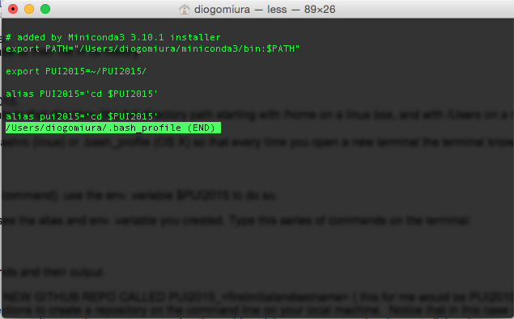
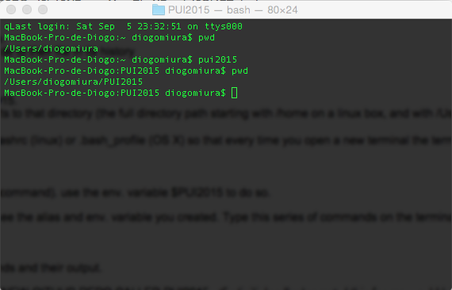

<<<<<<< HEAD
=======
=======
>>>>>>> 7761eb5fa7e9d42cadd4b926862c2ae06e8b8054
What I did to set up my environment:
1) Created the PUI2015 directory with the mkdir command;
2) Created the environment variable PUI2015 by adding the following line to my bash_profile: "export PUI2015=~/PUI2015/";
3) Created two aliases for the PUI directory by adding the following lines to my bash_profile: "alias PUI2015='cd $PUI2015'" and "alias pui2015='cd $PUI2015'";
4) Followed the HW/lab instructions to create the GitHub repo.

